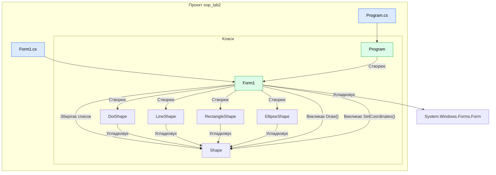

```mermaid
flowchart TD
    subgraph Project["Проєкт oop_lab2"]
        P["Program.cs"]
        F["Form1.cs"]

        subgraph Classes["Класи"]
            PC["Program"]
            FC["Form1"]
            SH["Shape"]
            DS["DotShape"]
            LS["LineShape"]
            RS["RectangleShape"]
            ES["EllipseShape"]
        end
    end

    P --> PC
    F --> FC

    PC -->|"Створює"| FC
    FC -->|"Успадковує"| WF["System.Windows.Forms.Form"]

    FC -->|"Зберігає список"| SH
    FC -->|"Створює"| DS
    FC -->|"Створює"| LS
    FC -->|"Створює"| RS
    FC -->|"Створює"| ES

    DS -->|"Успадковує"| SH
    LS -->|"Успадковує"| SH
    RS -->|"Успадковує"| SH
    ES -->|"Успадковує"| SH

    FC -->|"Викликає Draw()"| SH
    FC -->|"Викликає SetCoordinates()"| SH

    style P fill:#dbeafe,stroke:#2563eb,color:#000
    style F fill:#dbeafe,stroke:#2563eb,color:#000
    style FC fill:#dcfce7,stroke:#16a34a,color:#000
    style PC fill:#dcfce7,stroke:#16a34a,color:#000
```
