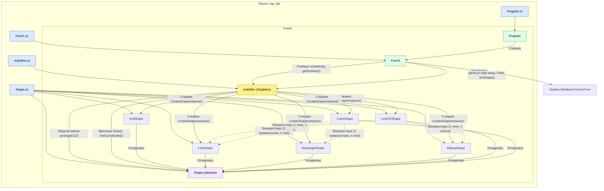

```mermaid
flowchart TD
    subgraph Project["Проєкт oop_lab"]
        P["Program.cs"]
        F["Form1.cs"]
        E["myEditor.cs"]
        S["Shape.cs"]

        subgraph Classes["Класи"]
            PC["Program"]
            FC["Form1"]
            ED["myEditor (Singleton)"]
            SH["Shape (abstract)"]
            DS["DotShape"]
            LS["LineShape"]
            RS["RectangleShape"]
            ES["EllipseShape"]
            LOOS["LineOOShape"]
            CS["CubeShape"]
        end
    end

    %% Зв'язки файлів і класів
    P --> PC
    F --> FC
    E --> ED
    S --> SH & DS & LS & RS & ES & LOOS & CS

    %% Ініціалізація та успадкування форми
    PC -->|"Створює"| FC
    FC -->|"Успадковує"| WF["System.Windows.Forms.Form"]

    %% Взаємодія Form1 та myEditor
    FC -->|"Отримує екземпляр getInstance()"| ED
    FC -->|"Делегує події миші, Paint, SetShape()"| ED

    %% Робота myEditor із фігурами
    ED -->|"Зберігає масив pcshape[122]"| SH
    ED -->|"Створює CreateShapeInstance()"| DS & LS & RS & ES & LOOS & CS
    ED -->|"Викликає Draw(), SetCoordinates()"| SH

    %% Успадкування фігур
    DS -->|"Успадковує"| SH
    LS -->|"Успадковує"| SH
    RS -->|"Успадковує"| SH
    ES -->|"Успадковує"| SH
    LOOS -->|"Успадковує"| SH
    CS -->|"Успадковує"| SH

    %% Композиція складених фігур
    LOOS -.->|"Використовує (1 лінія, 2 еліпси)"| LS & ES
    CS -.->|"Використовує (2 прямокутники, 4 лінії)"| RS & LS

    %% Стилізація
    style P fill:#dbeafe,stroke:#2563eb,color:#000
    style F fill:#dbeafe,stroke:#2563eb,color:#000
    style E fill:#dbeafe,stroke:#2563eb,color:#000
    style S fill:#dbeafe,stroke:#2563eb,color:#000

    style PC fill:#dcfce7,stroke:#16a34a,color:#000
    style FC fill:#dcfce7,stroke:#16a34a,color:#000
    style ED fill:#fef08a,stroke:#ca8a04,color:#000
    style SH fill:#f3e8ff,stroke:#9333ea,color:#000
```
